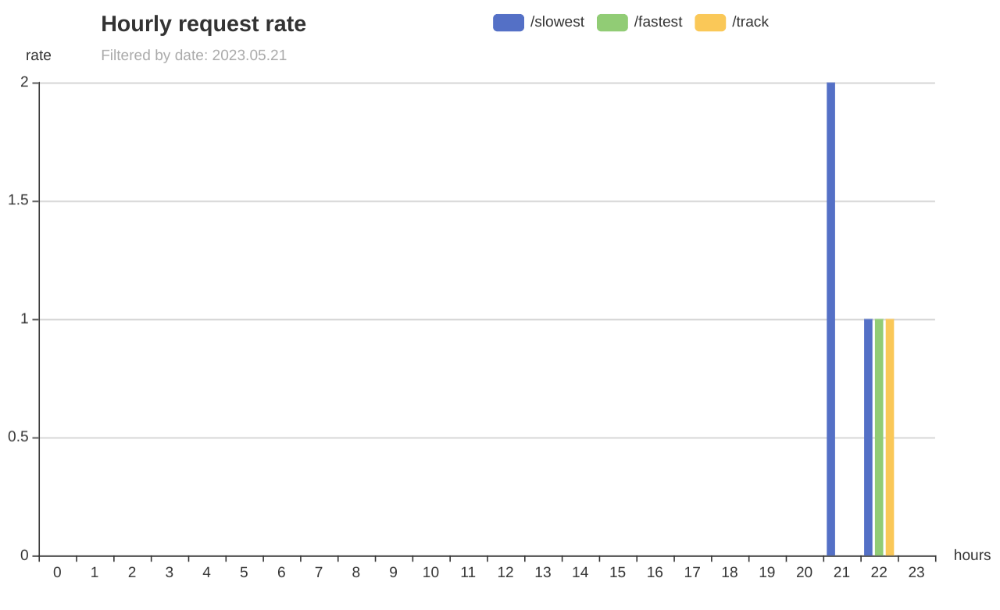

### About
hotracer is a sample service that can check time to first byte on different web-resources. 

### How to run

`make run-srv-linux`

### Resources

GET `/track` - recieves json with single field:

`{
    "url": "website.com"
}`

and respondes with following json:

`{
	"url": "website.com",
	"ttfb": "687.875447ms", 
	"error": ""
}`

GET `/fastest` - recieves no body; respondes with following json:

`{
	"url": "fastwebsite.com",
	"ttfb": "100.875447ms", 
	"error": ""
}`

GET `/slowest` - recieves no body; respondes with following json:

`{
	"url": "slowwebsite.com",
	"ttfb": "540.875447ms", 
	"error": ""
}`

Note that it returns the slowest resource among ones that were able to respond in less than 5s.

GET `/stats?{date=20001030}` - recieves "date" query parameter in YYYYMMDD format, when given no parameter uses current date. 

Respondes with html page that shows hourly request rate:

